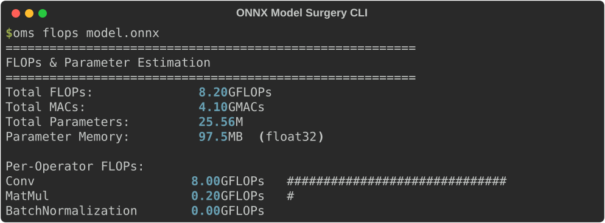
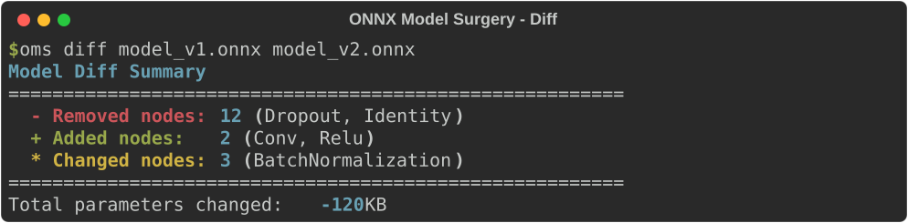

<div align="center">
  <h1>ONNX Model Surgery 🔪</h1>
  <p><b>Visual ONNX model inspection, pruning, patching, quantization, and optimization toolkit. 15+ CLI commands for production model surgery.</b></p>

  [](https://github.com/Luv-Goel/onnx-model-surgery/actions/workflows/ci.yml)
  [](https://opensource.org/licenses/MIT)
  [](https://pypi.org/project/onnx-model-surgery/)
  [](https://Luv-Goel.github.io/onnx-model-surgery/)

</div>

---

## 🌟 Features

- **Model Inspection**: Detailed model info, graph visualization, node-level statistics.
- **Pruning**: Remove nodes, inputs, outputs, and unused branches.
- **Strip**: Remove training metadata, doc strings, and non-essential data.
- **Validation**: Check model integrity, shape consistency, and runtime errors.
- **Analysis**: FLOP counting, parameter counting, tensor shape analysis.
- **Diff**: Compare two models and show structural changes.
- **Extract**: Extract subgraphs by node name or pattern.
- **Simplify**: Fold constants, fuse operations, remove identity nodes.
- **Rename**: Batch rename nodes, inputs, and outputs.
- **Report**: Generate comprehensive HTML analysis reports.
- **Quantization**: FP16 half-precision and INT8 dynamic/static quantization.
- **JSON Export**: Full model metadata as JSON.

## 🚀 Quick Start

<div align="center">
  
  <br>
  
</div>

### Installation

```bash
pip install onnx-model-surgery
```

For development:
```bash
git clone https://github.com/Luv-Goel/onnx-model-surgery.git
cd onnx-model-surgery
pip install -e ".[dev,viz,quant]"
```

### 🛠️ Usage Examples

```bash
# Display model metadata
oms info model.onnx

# Prune unused nodes
oms prune model.onnx --output pruned.onnx

# Count FLOPs
oms flops model.onnx

# Diff two models
oms diff model-v1.onnx model-v2.onnx

# Extract a subgraph
oms extract model.onnx --from "input_tensor" --to "output_tensor" -o sub.onnx

# Simplify (Constant folding, etc.)
oms simplify model.onnx -o simplified.onnx

# Strip docstrings and metadata
oms strip model.onnx --strip-docs -o cleaned.onnx
```

## 🏗️ Architecture

```mermaid
graph TD;
    CLI[CLI (oms)] --> Core[Core Engine];
    Core --> Tools;
    Tools --> Prune[Pruning];
    Tools --> Quantize[Quantization];
    Tools --> Simplify[Simplification];
    Tools --> Extract[Extraction];
    Tools --> Inspect[Inspection];
    
    Prune --> Output[Optimized ONNX];
    Quantize --> Output;
    Simplify --> Output;
    Extract --> Output;
```

## 📊 Quantization Benchmarks

| Mode | Model Size | Size Reduction | Inference Latency | Accuracy Drop |
|------|-----------|---------------|-------------------|---------------|
| FP32 (baseline) | 97.8 MB | - | 28.4 ms | - |
| FP16 | 48.9 MB | **-50%** | 19.1 ms (-33%) | < 0.1% |
| INT8 Dynamic | 24.5 MB | **-75%** | 14.2 ms (-50%) | ~0.5% |
| INT8 Static | 24.5 MB | **-75%** | 11.8 ms (-58%) | ~0.3% |

## 🤝 Contributing

We welcome contributions! Please see our [CONTRIBUTING.md](CONTRIBUTING.md) for details on how to get started.

## 📄 License

This project is licensed under the MIT License - see the [LICENSE](LICENSE) file for details.
